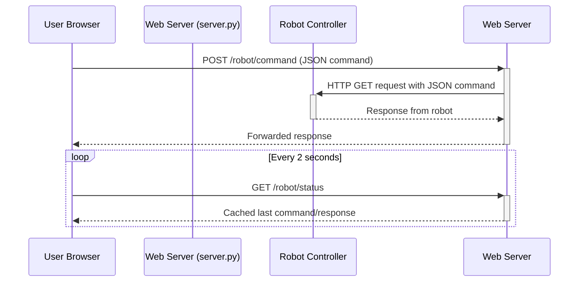

# System Architecture & Data Flow

This document outlines the high-level architecture of the robot arm control system, focusing on the data flow between the web interface, the server backend, the robot hardware, and external workers.

## Component Overview

The system consists of four primary components:

1.  **Web UI Frontend**: A user-facing interface built with HTML, CSS, and JavaScript. It provides controls for the robot, a live camera feed, an SDR waterfall display, and a chatbot interface.
2.  **Web Server Backend (`server.py`)**: A Python Flask application that serves the web UI. It acts as the central hub, handling HTTP requests from the frontend. Its responsibilities include:
    *   Proxying commands to the robot arm controller.
    *   Streaming video from the camera.
    *   Managing a job queue for the chatbot feature.
3.  **Robot & Peripherals**: The physical hardware, including the robot arm controller, a USB camera, and an SDR device (e.g., HackRF).
4.  **Chatbot Worker (`simple_python_client.py`)**: An external, decoupled Python script that acts as a sophisticated language model worker. It loads a fine-tuned Mixtral model with LoRA adapters to:
    *   Communicate with the Web Server to fetch chatbot prompts.
    *   Generate text responses using the model.
    *   Analyze the model's MoE expert selections during inference to extract hidden (steganographic) data.
    *   Return both the generated reply and the extracted expert usage patterns to the server.

## Data Flow Diagrams

### 1. Robot Control & Status Flow

Commands are sent from the UI to the robot via a simple HTTP proxy mechanism. Status is polled periodically.



### 2. Live Camera Stream

The video stream is captured by the server and sent to the UI as a Motion JPEG (MJPEG) stream, which is a sequence of JPEG images over HTTP.

```mermaid
graph TD
    subgraph Hardware
        Cam[USB Camera]
    end
    subgraph "Web Server (server.py)"
        A[CameraStream Thread] -- Captures frame --> B(Frame Buffer)
        C[Flask /video_feed Route] -- Reads frame --> B
    end
    subgraph "User Browser"
        D[img src="/video_feed"]
    end

    Cam -- /dev/video0 --> A
    C -- HTTP Response --> D
```

### 3. SDR Waterfall Stream

SDR data is captured and processed in a background thread, then broadcast to all connected UI clients via a WebSocket.

```mermaid
sequenceDiagram
    participant User Browser
    participant "Web Server (server.py)"
    participant "SDR Device (HackRF)"

    User Browser->>+Web Server: WebSocket Connect to /sdr
    Web Server-->>-User Browser: Connection established

    participant "SDR Streamer Thread"
    Note over Web Server, SDR Streamer Thread: Created on first client connect

    loop Streaming Loop
        SDR Streamer Thread->>+SDR Device: readStream()
        SDR Device-->>-SDR Streamer Thread: IQ Samples
        SDR Streamer Thread->>SDR Streamer Thread: Compute FFT/PSD
        SDR Streamer Thread->>-Web Server: Broadcast JSON data
    end

    Web Server-->>User Browser: WebSocket push (PSD data)
```

### 4. Chatbot Interaction Flow

The chatbot feature uses a job queue pattern implemented over HTTP. The web server acts as a broker between the frontend and the chatbot worker.

```mermaid
sequenceDiagram
    participant User Browser
    participant "Web Server (server.py)"
    participant "Chatbot Worker (simple_python_client.py)"

    User Browser->>+Web Server: POST /chatbot (message)
    Web Server->>Web Server: Enqueue job {job_id, message}
    Web Server-->>-User Browser: {job_id}

    loop Poll for Job
        Chatbot Worker->>+Web Server: GET /chatbot/next
        Web Server-->>-Chatbot Worker: {job_id, message} or {status: 'no_jobs'}
    end

    Note right of Chatbot Worker: Load model, process message,<br/>run inference, extract expert patterns...

    Chatbot Worker->>+Web Server: POST /chatbot/submit (results)
    Web Server-->>-Chatbot Worker: {status: 'ok'}

    loop Poll for Result
        User Browser->>+Web Server: GET /chatbot/result/&lt;job_id&gt;
        Web Server-->>-User Browser: {status: 'pending'} or {reply, ...}
    end
```

### Job Assignment

When the server has a job in the queue, it sends the job details (`job_id` and `message`) to the worker and removes the job from the queue. If no jobs are available, it tells the worker to wait.

### Worker Processes Job

The worker receives the job and runs inference with its loaded language model to generate a reply. During this process, it also analyzes the patterns of MoE expert usage to decode a hidden message.

### Worker Submits Result

Once processing is complete, the worker sends the results—including the text reply and detailed expert selection data—back to the server in a `POST` request to the `/chatbot/submit` endpoint.

### Frontend Polls for Result

Concurrently, the user's browser polls the `/chatbot/result/<job_id>` endpoint every second, checking if the job is complete.

### Result Retrieval

Initially, the server responds with a `pending` status. Once the worker has submitted the result, the server stores it. On the next poll from the browser, the server sends the final result, which is then displayed to the user in the UI. 